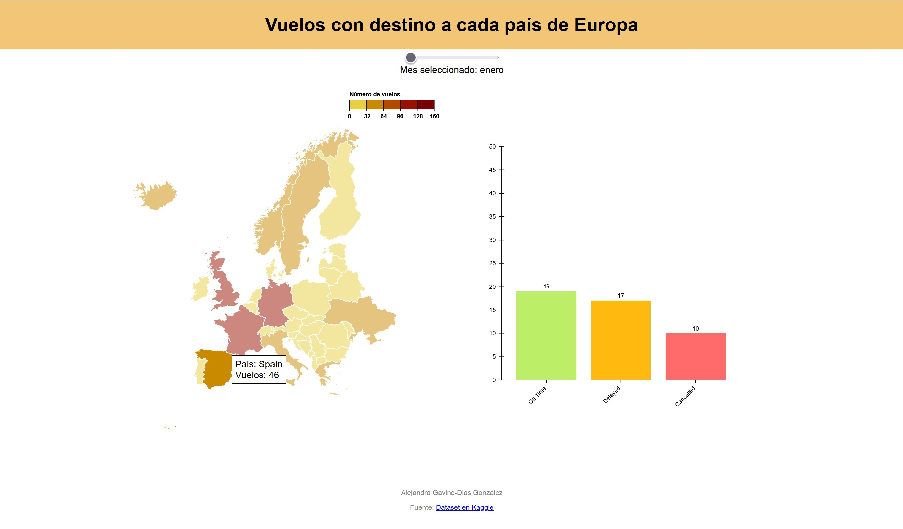

# AnalisisVuelos

Table of Conents

1. [Descripción](https://gitlab.inf.uva.es/desi_23-24/analisisvuelos/-/tree/main#descripci%C3%B3n)
2. [Vista](https://gitlab.inf.uva.es/desi_23-24/analisisvuelos/-/tree/main#vista)
3. [Herramientas](https://gitlab.inf.uva.es/desi_23-24/analisisvuelos/-/tree/main#herramientas)
4. [Uso](https://gitlab.inf.uva.es/desi_23-24/analisisvuelos/-/tree/main#uso)
5. [Autor y Referencias](https://gitlab.inf.uva.es/desi_23-24/analisisvuelos/-/tree/main#autor-y-referencias)

## Descripción
Visualización sobre los viajeros que vuelan con destino a paises europeos con el [dataset](https://www.kaggle.com/datasets/iamsouravbanerjee/airline-dataset/data), los datos provienen de una simulación con una herramienta que permite hacer datasets sintéticos que se asemejan mucho a datos reales.
En la visualización tenemos un mapa coroplético donde cada país está coloreado siguiendo una escala de colores dependiendo de los viajeros que llegan a ese país ese mes.
 
A la derecha del mapa tenemos un diagrama de barras con los datos detallados, cuantos viajeros han llegado a tiempo y cuántos han sufrido retrasos y cancelaciones.

## Vista

## Herramientas
Para realizar esta visualización se ha utilizado la librería d3, para más información visitar (https://d3js.org/), también se ha utilizado html y css.
Las herramientas web para realizar la escala de color del mapa está referenciada en las [herramientas usadas](https://gitlab.inf.uva.es/desi_23-24/analisisvuelos/-/edit/main/README.md?ref_type=heads#herramientas-usadas).

## Uso
En la parte superior de la visualización tenemos un slider para cambiar el mes que queremos visualizar, los datos del mapa cambiarán automaticamente.
Un texto bajo el slider indicará el mes que estamos mostrando.
 
Si pasamos el ratón por encima de cada país, se mostrará un tooltip que indica el nombre del país y el número de viajeros que llegan a ese pais.
 
Si clicamos en el país, se mostrarán los datos detallados en el diagrama de barras correspondiente a ese país.
Si estamos mostrando datos en el diagrama de barras, al cambiar el slider se reseteará para no inducir a confusiones.
En la parte inferior del diagrama de barras se mostrará una ayuda para indicar que si se selecciona un país se mostrarán los datos detallados.
Cuando se estén mostrando los datos de un país en el diagrama de barras, se indicará el país al que corresponden con un texto en la parte inferior.

## Autor y Referencias
Alejandra Gavino-Dias González (alejandra.gavino-dias@estudiantes.uva.es)

### Fuentes
- https://www.flightradar24.com
- https://www.kaggle.com/datasets/iamsouravbanerjee/airline-dataset/data
- https://icons8.com/icon/15121/airplane-take-off

### Referencias
- https://d3-graph-gallery.com/graph/choropleth_basic.html
- https://d3-graph-gallery.com/graph/interactivity_tooltip.html
- https://codepen.io/bwiacek/pen/pXZEvK
- https://github.com/leakyMirror/map-of-europe/tree/master/GeoJSON
- https://observablehq.com/@d3/color-legend
- https://observablehq.com/@d3/bar-chart/2
- https://d3-graph-gallery.com/graph/barplot_animation_start.html

### Herramientas usadas
- https://hihayk.github.io/scale/#4/3/49/76/96/13/7/1/DCCE00/227/73/119/white
- https://coolors.co/

